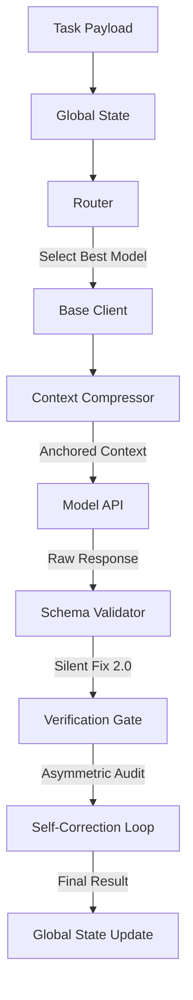

# Antigravity Agent OS

[](https://opensource.org/licenses/MIT)

**Antigravity Agent OS** is an industrial-grade, resilient AI orchestration kernel designed to solve common LLM application challenges: model unreliability, context overflow, and uncontrolled API costs. It transforms a collection of fragile API calls into a robust, self-healing "Operating System" for AI agents.

## 🚀 Key Features

-   **AI Guardrail**: Active scanning for prompt injection attempts and automated PII/sensitive data redaction.
-   **Health-Aware Routing**: Real-time latency and health monitoring (Heartbeat) to route tasks to the most optimal model endpoint.
-   **Cascading Failover**: Automatically retries tasks with backup models if the primary one fails, ensuring mission completion.
-   **Key-Insight Anchoring**: A smart context compressor that protects mission-critical instructions (Objectives & Constraints) while summarizing conversation history.
-   **Multi-Provider Quota Monitor**: Real-time tracking of token usage across providers (NVIDIA, Google, DeepSeek) with automated quota-limit alerts.
-   **Asymmetric Verification**: High-tier model outputs are audited by cost-effective base-tier models, ensuring quality without breaking the bank.
-   **SilentFix 2.0**: A structural self-healing engine that automatically repairs malformed JSON, truncated responses, and unescaped characters.
-   **Optimistic State Management**: Version-controlled global state (OCC) for consistent multi-agent collaboration.

## 🧠 Design Philosophy: Why Agent OS?

In the AI-native era, developers often struggle between "High Intelligence but Expensive" and "Low Cost but Forgetful". Agent OS is built to eliminate this decision fatigue.

### 🌟 When to use Agent OS?
1.  **Preventing "Context Drift"**: When the conversation grows long or documents are massive, Agent OS uses "Key-Insight Anchoring" to ensure the AI never loses sight of your original objectives.
2.  **Mission-Critical Precision**: For tasks involving security, DB logic, or strict JSON formatting, the "Dual-Verification Gate" ensures production-grade output.
3.  **Automated Model Orchestration**: Let the "Router" decide the best model based on real-time API health and task complexity, so you don't have to.

## 📖 Documentation
- [Detailed Usage Guide](USAGE_GUIDE.md)
- [Architecture Details (RPD)](RPD.md)
- [API Setup Guide](API_SETUP_GUIDE.md)

## 🏗️ Architecture



## 🛠️ Quick Start

1.  **Clone & Install**:
    ```bash
    git clone https://github.com/[your-username]/model-hub-agent.git
    cd model-hub-agent
    npm install
    ```

2.  **Configuration**:
    Copy `.env.example` to `.env` and add your API keys:
    - `NVIDIA_API_KEY`
    - `GEMINI_API_KEY`
    - `DEEPSEEK_API_KEY`

3.  **Run the Kernel**:
    ```bash
    node main.js
    ```

## 🧪 Testing
Unit tests for all core modules are located in the `tests/` directory.
```bash
node tests/test_silent_fix.js
node tests/test_compression.js
```

## 🙏 Acknowledgements
This project was inspired by discussions within the [free-claude-code](https://github.com/Alishahryar1/free-claude-code) community. It has been extensively refactored and evolved into a resilient orchestration kernel specifically optimized for the **Antigravity** framework.

## 📄 License
This project is licensed under the MIT License - see the [LICENSE](LICENSE) file for details.
