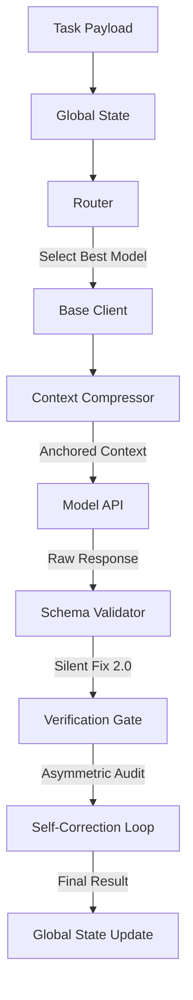

# Antigravity Agent OS (AI Agent Kernel)

[English](README.md) | [繁體中文](README_ZH.md)

**Antigravity Agent OS** is an industrial-grade, highly resilient AI orchestration kernel.

[](https://opensource.org/licenses/MIT)

**Antigravity Agent OS** is an industrial-grade, resilient AI orchestration kernel designed to solve common LLM application challenges: model unreliability, context overflow, and uncontrolled API costs. It transforms a collection of fragile API calls into a robust, self-healing "Operating System" for AI agents.

## 🚀 Key Features

-   **AI Guardrail**: Active scanning for prompt injection attempts and automated PII/sensitive data redaction.
-   **Health-Aware Routing**: Real-time latency and health monitoring (Heartbeat) to route tasks to the most optimal model endpoint.
-   **Cascading Failover**: Automatically retries tasks with backup models if the primary one fails, ensuring mission completion.
-   **Key-Insight Anchoring**: A smart context compressor that protects mission-critical instructions (Objectives & Constraints) while summarizing conversation history.
-   **Multi-Provider Quota Monitor**: Real-time tracking of token usage across providers (NVIDIA, Google, DeepSeek) with automated quota-limit alerts.
-   **Asymmetric Verification**: High-tier model outputs are audited by cost-effective base-tier models, ensuring quality without breaking the bank.
-   **SilentFix 2.0**: A structural self-healing engine that automatically repairs malformed JSON, truncated responses, and unescaped characters.
-   **Optimistic State Management**: Version-controlled global state (OCC) for consistent multi-agent collaboration.

## 🧠 Design Philosophy: Why Agent OS?

In the AI-native era, developers often struggle between "High Intelligence but Expensive" and "Low Cost but Forgetful". Agent OS is built to eliminate this decision fatigue.

### 🌟 When to use Agent OS?
1.  **Preventing "Context Drift"**: When the conversation grows long or documents are massive, Agent OS uses "Key-Insight Anchoring" to ensure the AI never loses sight of your original objectives.
2.  **Mission-Critical Precision**: For tasks involving security, DB logic, or strict JSON formatting, the "Dual-Verification Gate" ensures production-grade output.
3.  **Automated Model Orchestration**: Let the "Router" decide the best model based on real-time API health and task complexity, so you don't have to.

## 📖 Documentation
- [Detailed Usage Guide](USAGE_GUIDE.md)
- [Architecture Details (RPD)](RPD.md)
- [API Setup Guide](API_SETUP_GUIDE.md)

## 🏗️ Architecture



## 🛠️ Quick Start

1.  **Clone & Install**:
    ```bash
    git clone https://github.com/[your-username]/model-hub-agent.git
    cd model-hub-agent
    npm install
    ```

2.  **Configuration**:
    Copy `.env.example` to `.env` and add your API keys:
    - `NVIDIA_API_KEY`
    - `GEMINI_API_KEY`
    - `DEEPSEEK_API_KEY`
    - `GCP_KEY_PATH` (Set to the absolute path of your GCP Service Account JSON key, e.g., `gcp-key.json`)

    *For GCP Vertex AI setup details, please refer to [vertex_ai_setup_guide.html](vertex_ai_setup_guide.html) (Local File).*

3.  **Run the Kernel**:
    ```bash
    node main.js
    ```

## 🧪 Testing
Unit tests for all core modules are located in the `tests/` directory.
```bash
node tests/test_silent_fix.js
node tests/test_compression.js
node tests/test_vertex_ai.js
```

## 🔑 GCP Vertex AI (Agent Platform) Postpaid Configuration

This project supports using a **GCP Service Account JSON Key** to call the Vertex AI (Agent Platform) API. This is the **ultimate solution** to bypass the Google AI Studio `429 Your prepayment credits are depleted` billing sync bug, allowing the kernel to directly consume your Google Cloud postpaid billing funds and promotional credits.

### 🛠️ Setup Steps:
1. **Get JSON Key**: Create a JSON key for your GCP Service Account in the GCP Console and download it (e.g., save as `gcp-key.json`). **Note: This key file is ignored in `.gitignore` to prevent credential leaks.**
2. **Grant IAM Role**: In the GCP Console IAM page, grant the **`Agent Platform User`** role (formerly `Vertex AI User`) to this Service Account.
3. **Enable API**: Enable the **`Agent Platform API`** (formerly `Vertex AI API`, service name: `aiplatform.googleapis.com`) in your project's API Library.
4. **Configure Environment**: Set the `GCP_KEY_PATH` variable in your `.env` file pointing to the absolute path of your key:
   ```env
   GCP_KEY_PATH=c:\path\to\your\gcp-key.json
   ```
5. **Use in Code**: Query models using the ID prefix `vertex/gemini-2.5-flash` or similar. The client will automatically sign OAuth2 JWTs and route requests to Vertex AI.

For a detailed step-by-step tutorial, open the local guide in your browser:
👉 **[vertex_ai_setup_guide.html](vertex_ai_setup_guide.html)**

## 🪙 Token-Saving Optimization Strategies

Agent OS implements several industrial-grade optimization mechanisms to minimize token usage, bypass API rate limits, and control operational costs.

### 1. Key-Insight Anchoring (Context Compression)
- **Mechanism**: Dynamic context compression that trims conversation histories, logs, or intermediate steps when total tokens exceed the model capability threshold. Crucially, it anchors and protects high-priority system inputs (`objective` and `constraints`) to prevent model amnesia.
- **Source File**: [context_compressor.js](file:///c:/Users/etrny/.gemini/antigravity/scratch/model-hub-agent/infrastructure/adapters/context_compressor.js)
- **Detailed Guide**: [AGENT_OS_JOURNAL_AND_COST_GUIDE.md:L39](file:///c:/Users/etrny/.gemini/antigravity/scratch/model-hub-agent/AGENT_OS_JOURNAL_AND_COST_GUIDE.md#L39)

### 2. SilentFix 2.0 (Local Error Repair)
- **Mechanism**: Instead of resending entire prompts upon receiving minor output syntax errors (e.g., missing braces, trailing commas, or Markdown codeblock wrapping), the validation engine parses and repairs JSON structures locally. This completely avoids redundant retry API calls (which double token cost).
- **Source File**: [schema_validator.js](file:///c:/Users/etrny/.gemini/antigravity/scratch/model-hub-agent/infrastructure/adapters/schema_validator.js)
- **Detailed Guide**: [AGENT_OS_JOURNAL_AND_COST_GUIDE.md:L35](file:///c:/Users/etrny/.gemini/antigravity/scratch/model-hub-agent/AGENT_OS_JOURNAL_AND_COST_GUIDE.md#L35)

### 3. Capability-Aware Dynamic Routing
- **Mechanism**: Tasks are analyzed and dynamically routed to the most cost-effective tier. Routine or formatting tasks are dispatched to low-cost standard models (e.g., DeepSeek, Llama-3.1-8B), reserving premium high-tier models (e.g., Gemini 1.5 Pro) for final audits or complex reasoning.
- **Source File**: [router.js](file:///c:/Users/etrny/.gemini/antigravity/scratch/model-hub-agent/services/router.js)
- **Detailed Guide**: [AGENT_OS_JOURNAL_AND_COST_GUIDE.md:L29](file:///c:/Users/etrny/.gemini/antigravity/scratch/model-hub-agent/AGENT_OS_JOURNAL_AND_COST_GUIDE.md#L29)

### 4. Asymmetric Verification (Dual-Verification Gate)
- **Mechanism**: Generates responses using standard models and performs strict logical validation using lightweight, high-performance base models. By splitting generation and auditing asynchronously, it avoids running premium models on the entire orchestration flow.
- **Source File**: [verification_gate.js](file:///c:/Users/etrny/.gemini/antigravity/scratch/model-hub-agent/services/verification_gate.js)
- **Detailed Guide**: [AGENT_OS_JOURNAL_AND_COST_GUIDE.md:L20](file:///c:/Users/etrny/.gemini/antigravity/scratch/model-hub-agent/AGENT_OS_JOURNAL_AND_COST_GUIDE.md#L20)

### 5. Document-to-Markdown Preprocessing (MarkItDown)
- **Mechanism**: Converts heavy document formats (PDF, DOCX, XLSX, HTML) into clean, structure-preserved Markdown before LLM ingestion. Eliminates boilerplate HTML/CSS tags (saving up to 90% tokens) and avoids repeating expensive Vision API tokens for images by converting them to text descriptions once.
- **Source File**: [markitdown_adapter.js](file:///c:/Users/etrny/.gemini/antigravity/scratch/model-hub-agent/infrastructure/adapters/markitdown_adapter.js)
- **Integration Test**: [test_markitdown_agent.js](file:///c:/Users/etrny/.gemini/antigravity/scratch/model-hub-agent/tests/test_markitdown_agent.js)

## 🙏 Acknowledgements & Evolution History

This project was inspired by discussions within the [free-claude-code](https://github.com/Alishahryar1/free-claude-code) community. It has been extensively refactored and evolved into a resilient orchestration kernel specifically optimized for the **Antigravity** framework.

### 🔄 Project Evolution History

Agent OS has undergone several critical architectural upgrades, each driven by real-world challenges encountered during development (such as token waste, uncontrolled API costs, and service limits):

1. **Phase 1: Core Adaptation & Resilient Defense** (2026-05-12 to 2026-06-15)
   - **Trigger**: AI agents executing complex JSON tasks often wasted API tokens on retrying due to minor formatting errors (e.g., stray Markdown markers). Long conversation histories also caused model "amnesia" (forgetting the initial objectives).
   - **Solution**: Developed [context_compressor.js](file:///c:/Users/etrny/.gemini/antigravity/scratch/model-hub-agent/infrastructure/adapters/context_compressor.js) (Key-Insight Anchoring to lock objectives/constraints) and [schema_validator.js](file:///c:/Users/etrny/.gemini/antigravity/scratch/model-hub-agent/infrastructure/adapters/schema_validator.js) (SilentFix to locally heal JSON syntaxes without retries).

2. **Phase 2: Intelligent Routing & Multi-Model Audits** (2026-06-15 to 2026-06-26)
   - **Trigger**: Directing all queries to top-tier reasoning models caused high costs, while routing everything to lightweight models led to semantic drift and logical bugs.
   - **Solution**: Built a capability-aware router and [verification_gate.js](file:///c:/Users/etrny/.gemini/antigravity/scratch/model-hub-agent/services/verification_gate.js) (Asymmetric Verification Gate), implementing an asynchronous drafting-reviewing pipeline that balances low cost with high logic accuracy.

3. **Phase 3: Postpaid Vertex AI Integration (AI Studio 429 Bug Fix)** (2026-06-26 to 2026-06-27)
   - **Trigger**: Google AI Studio API Keys frequently threw `429 Your prepayment credits are depleted` errors when querying Gemini 2.5 models, due to a known billing synchronization bug.
   - **Solution**: Upgraded Gemini client authentication to support GCP Service Account JSON keys. Routed core queries to the enterprise **Vertex AI (Agent Platform) API**, directly consuming postpaid billing and promotional credits to bypass Studio's prepay limits.
   - **Guide**: [vertex_ai_setup_guide.html](file:///c:/Users/etrny/.gemini/antigravity/scratch/model-hub-agent/vertex_ai_setup_guide.html).

4. **Phase 4: Restricting Browser Tool Misuse** (2026-06-27)
   - **Trigger**: Opening browser windows (`browser_subagent`) to scrape simple page elements led to massive token spikes and ballooning API bills.
   - **Solution**: Enforced a project rule restricting browser tool usage. AI agents must prioritize lightweight HTTP methods (e.g., `read_url_content`) or specific Notion MCP tools to retrieve web data instead.

5. **Phase 5: Document-to-Markdown Preprocessing (MarkItDown Integration)** (2026-06-27 to 2026-06-28)
   - **Trigger**: Feeding raw HTML, PDFs, Excel sheets, or Word files into the LLM ingested heavy layout formatting, boilerplate code, and redundant Vision tokens.
   - **Solution**: Forked [microsoft/markitdown](https://github.com/microsoft/markitdown) locally as [etrnya/markitdown](https://github.com/etrnya/markitdown), and implemented [markitdown_adapter.js](file:///c:/Users/etrny/.gemini/antigravity/scratch/model-hub-agent/infrastructure/adapters/markitdown_adapter.js) to pre-convert files to structured Markdown, reducing token costs by 50% - 90%.

## 📄 License
This project is licensed under the MIT License - see the [LICENSE](LICENSE) file for details.
