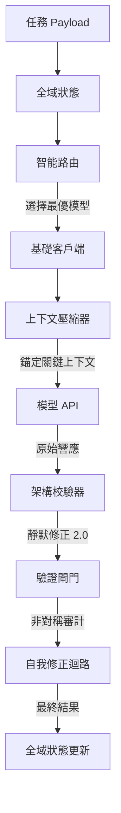

# Antigravity Agent OS (AI 代理作業系統內核)

[English](README.md) | [繁體中文](README_ZH.md)

**Antigravity Agent OS** 是一個工業級、具備高韌性的 AI 調度內核。它不僅僅是一個模型切換器，更是一個能主動防禦外部 API 不穩定性、優化上下文空間並嚴格控制成本的「代理作業系統」。

## 🌟 核心價值

在開發 LLM 應用時，開發者常遇到：模型幻覺導致 JSON 報錯、上下文太長導致 Token 炸裂、以及高階模型費用昂貴。本專案透過以下技術解決這些問題：

-   **安全護欄 (Guardrail)**：主動攔截提示詞注入攻擊 (Prompt Injection) 並自動對敏感數據（如 API Keys）進行脫敏。
-   **健康感知路由 (Router)**：自動偵測各供應商延遲與狀態，壞掉的模型自動避開。
-   **級聯故障轉場 (Cascading Executor)**：首選模型失敗時，自動切換至備援模型繼續執行，確保任務不中斷。
-   **核心錨點壓縮 (Context Compressor)**：獨創「關鍵洞察錨定」技術，壓縮歷史對話的同時，絕對保護「任務目標」與「硬約束」。
-   **非對稱雙重驗證 (Verification Gate)**：用廉價模型 (如 Llama 8B) 來審計高階模型 (如 Claude 3.5) 的輸出，實現低成本的品質監控。
-   **供應商配額監控 (Quota Monitor)**：即時統計各供應商 (NVIDIA, Gemini, DeepSeek) 的 Token 消耗，並在接近免費額度上限時發出預警。
-   **靜默修正 2.0 (SilentFix)**：具備結構化修復能力，自動修補被截斷的 JSON 或非法換行符。
-   **樂觀並行狀態 (Global State)**：採用版本號控制 (OCC)，確保多個 Agent 協作時數據一致。

## 🧠 設計哲學：為什麼需要 Agent OS？

在 AI 開發中，我們常面臨「昂貴但聰明」與「廉價但健忘」的抉擇。Agent OS 的存在是為了讓您不再糾結於模型選擇。

### 🌟 三大黃金啟動時機
1.  **預防 AI 「失憶」 (Context Drift)**：當任務對話過長或文件內容極大時，啟動核心錨定機制，確保 AI 不會忘記您的最初限制條件。
2.  **追求「絕對精密」 (Precision Required)**：處理涉及安全、數據庫邏輯或需要嚴格 JSON 格式的任務時，透過雙重驗證確保產出品質。
3.  **解決「模型選擇焦慮」**：當您不確定該用哪個模型最划算時，讓 Router 根據當前 API 健康度與任務難度自動為您決策。

## 📖 專案文件
- [詳細使用手冊](USAGE_GUIDE_ZH.md)
- [架構設計說明 (RPD)](RPD.md)
- [API 配置指南](API_SETUP_GUIDE.md)

## 📐 系統架構



## 🚀 快速開始

1.  **安裝依賴**：
    ```bash
    npm install
    ```

2.  **配置環境變數**：
    將 `.env.example` 複製為 `.env` 並填入您的 API Keys，以及 `GCP_KEY_PATH`（指向您的 GCP 服務帳戶 JSON 金鑰路徑，例如 `gcp-key.json`）。
    
    *詳細的 GCP Vertex AI 啟用與授權設定，請參考 [vertex_ai_setup_guide.html](vertex_ai_setup_guide.html) (本機說明網頁)。*

3.  **執行互動式指令 (推薦)**：
    ```bash
    node cli.js
    ```
    直接在終端機輸入任務目標與要求，無需修改代碼。

4.  **代碼整合模式**：
    引用 `main.js` 中的 `dispatchTask` 函式進行任務分發。

## 🔑 GCP Vertex AI (Agent Platform) 後付款設定 (解決 429 扣款 Bug)

本專案支援使用 **GCP 服務帳戶 JSON 金鑰** 呼叫 Vertex AI (Agent Platform) API，以**完美解決** Google AI Studio 因 Prepay 獨立錢包計費同步問題導致的 `429 Your prepayment credits are depleted` 錯誤，直接消耗您在 Google Cloud 帳戶中的後付資金與免費抵免額 (Credits)。

### 🛠️ 設定步驟：
1. **取得 JSON 金鑰**：在 GCP 控制台為服務帳戶建立 JSON 格式的金鑰檔並下載（例如命名為 `gcp-key.json`，**本專案已將其加入 `.gitignore` 以防外洩**）。
2. **授予 IAM 角色**：在 GCP Console 的 IAM 頁面，為該服務帳戶授予 **`Agent Platform 使用者` (Agent Platform User)** 角色（即舊版 `Vertex AI User`）。
3. **啟用 API**：在專案中啟用 **`Agent Platform API`** (即舊版 `Vertex AI API`，服務名稱 `aiplatform.googleapis.com`)。
4. **配置環境變數**：在 `.env` 中設定 `GCP_KEY_PATH` 指向金鑰檔案的絕對路徑：
   ```env
   GCP_KEY_PATH=c:\path\to\your\gcp-key.json
   ```
5. **在註冊表中使用**：使用模型 ID `vertex/gemini-2.5-flash`，系統會自動使用該 JSON 金鑰進行 OAuth2 JWT 簽章並完成 API 呼叫。

詳細的一步一步排錯與教學，請直接雙擊開啟本機的說明網頁：
👉 **[vertex_ai_setup_guide.html](vertex_ai_setup_guide.html)**

## 🪙 Token 節省與優化策略

Agent OS 內置了多種工業級的 Token 優化機制，以最小化 API 調用開銷、避免頻率限制並控制運行成本：

### 1. 核心錨點壓縮 (Key-Insight Anchoring)
- **機制**：當任務狀態（Global State）的 Token 總數快要溢出模型限制時，系統會自動裁剪或摘要歷史對話與日誌等靈活數據。同時，會將關鍵的 `objective`（目標）與 `constraints`（硬約束）作為「核心錨點」強制鎖定，防止模型失憶。
- **原始碼路徑**：[context_compressor.js](file:///c:/Users/etrny/.gemini/antigravity/scratch/model-hub-agent/infrastructure/adapters/context_compressor.js)
- **詳細指南**：[AGENT_OS_JOURNAL_AND_COST_GUIDE.md:L39](file:///c:/Users/etrny/.gemini/antigravity/scratch/model-hub-agent/AGENT_OS_JOURNAL_AND_COST_GUIDE.md#L39)

### 2. 靜默修復 2.0 (SilentFix 2.0)
- **機制**：當模型輸出 JSON 產生微小語法錯誤（如漏寫括號、多出逗號、或夾帶 Markdown 標籤）時，驗證引擎會於本地背景直接進行正則修復，而非重新發送 API 請求。這從根本上杜絕了因重試帶來的雙倍 Token 浪費。
- **原始碼路徑**：[schema_validator.js](file:///c:/Users/etrny/.gemini/antigravity/scratch/model-hub-agent/infrastructure/adapters/schema_validator.js)
- **詳細指南**：[AGENT_OS_JOURNAL_AND_COST_GUIDE.md:L35](file:///c:/Users/etrny/.gemini/antigravity/scratch/model-hub-agent/AGENT_OS_JOURNAL_AND_COST_GUIDE.md#L35)

### 3. 能力感知動態路由
- **機制**：Router 會根據任務複雜度與模態要求，動態分流至最划算的費率層。一般的格式化或簡單處理任務會自動導向低成本模型（如 DeepSeek、Llama-3.1-8B），僅在最終審計或複雜推理時才調用昂貴的高階模型（如 Gemini 1.5 Pro）。
- **原始碼路徑**：[router.js](file:///c:/Users/etrny/.gemini/antigravity/scratch/model-hub-agent/services/router.js)
- **詳細指南**：[AGENT_OS_JOURNAL_AND_COST_GUIDE.md:L29](file:///c:/Users/etrny/.gemini/antigravity/scratch/model-hub-agent/AGENT_OS_JOURNAL_AND_COST_GUIDE.md#L29)

### 4. 非對稱審計 (Asymmetric Verification Gate)
- **機制**：採用「標準模型草擬、輕量高效模型校驗」的分層非對稱架構。以低成本方式稽核高階模型或前置步驟的輸出，避免整條工作鏈都堆疊在高單價的 Token 消耗上。
- **原始碼路徑**：[verification_gate.js](file:///c:/Users/etrny/.gemini/antigravity/scratch/model-hub-agent/services/verification_gate.js)
- **詳細指南**：[AGENT_OS_JOURNAL_AND_COST_GUIDE.md:L20](file:///c:/Users/etrny/.gemini/antigravity/scratch/model-hub-agent/AGENT_OS_JOURNAL_AND_COST_GUIDE.md#L20)

### 5. 文件轉 Markdown 預處理 (MarkItDown 整合)
- **機制**：在 LLM 讀取前，先將 HTML、PDF、Word、Excel 等笨重格式轉換為乾淨且保留結構的 Markdown，剝離所有樣式代碼與格式冗餘（Token 節省率達 50% - 90%）。對於圖片/圖表，僅在轉檔時調用一次 Vision API 進行 OCR 描述，在後續對話中重複利用純文字，免去重複支付昂貴的 Vision Token 費用。
- **原始碼路徑**：[markitdown_adapter.js](file:///c:/Users/etrny/.gemini/antigravity/scratch/model-hub-agent/infrastructure/adapters/markitdown_adapter.js)
- **整合測試**：[test_markitdown_agent.js](file:///c:/Users/etrny/.gemini/antigravity/scratch/model-hub-agent/tests/test_markitdown_agent.js)

## 📂 目錄結構
- `/infrastructure`: 包含各 API 客戶端與校驗器。
- `/services`: 核心調度邏輯與驗證閘門。
- `/shared`: 全域狀態管理與數據結構定義。
- `/tests`: 包含各模組的單元測試。

## 🙏 致謝與開發背景
本專案的靈感源於 [free-claude-code](https://github.com/Alishahryar1/free-claude-code) 專案社群的討論。為了解決複雜任務中的穩定性問題，我們將其核心思想進行了大規模重構，演進為一套適合 **Antigravity** 框架使用的、具備自癒能力的代理作業系統內核。

## 📜 授權協議
本專案採用 [MIT License](LICENSE) 授權。
