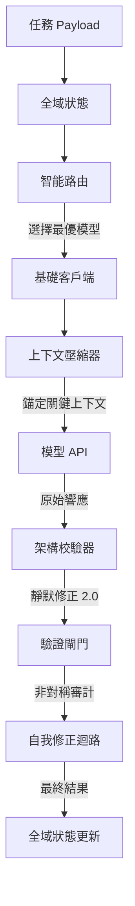

# Antigravity Agent OS (AI 代理作業系統內核)

**Antigravity Agent OS** 是一個工業級、具備高韌性的 AI 調度內核。它不僅僅是一個模型切換器，更是一個能主動防禦外部 API 不穩定性、優化上下文空間並嚴格控制成本的「代理作業系統」。

## 🌟 核心價值

在開發 LLM 應用時，開發者常遇到：模型幻覺導致 JSON 報錯、上下文太長導致 Token 炸裂、以及高階模型費用昂貴。本專案透過以下技術解決這些問題：

-   **安全護欄 (Guardrail)**：主動攔截提示詞注入攻擊 (Prompt Injection) 並自動對敏感數據（如 API Keys）進行脫敏。
-   **健康感知路由 (Router)**：自動偵測各供應商延遲與狀態，壞掉的模型自動避開。
-   **級聯故障轉場 (Cascading Executor)**：首選模型失敗時，自動切換至備援模型繼續執行，確保任務不中斷。
-   **核心錨點壓縮 (Context Compressor)**：獨創「關鍵洞察錨定」技術，壓縮歷史對話的同時，絕對保護「任務目標」與「硬約束」。
-   **非對稱雙重驗證 (Verification Gate)**：用廉價模型 (如 Llama 8B) 來審計高階模型 (如 Claude 3.5) 的輸出，實現低成本的品質監控。
-   **供應商配額監控 (Quota Monitor)**：即時統計各供應商 (NVIDIA, Gemini, DeepSeek) 的 Token 消耗，並在接近免費額度上限時發出預警。
-   **靜默修正 2.0 (SilentFix)**：具備結構化修復能力，自動修補被截斷的 JSON 或非法換行符。
-   **樂觀並行狀態 (Global State)**：採用版本號控制 (OCC)，確保多個 Agent 協作時數據一致。

## 🧠 設計哲學：為什麼需要 Agent OS？

在 AI 開發中，我們常面臨「昂貴但聰明」與「廉價但健忘」的抉擇。Agent OS 的存在是為了讓您不再糾結於模型選擇。

### 🌟 三大黃金啟動時機
1.  **預防 AI 「失憶」 (Context Drift)**：當任務對話過長或文件內容極大時，啟動核心錨定機制，確保 AI 不會忘記您的最初限制條件。
2.  **追求「絕對精密」 (Precision Required)**：處理涉及安全、數據庫邏輯或需要嚴格 JSON 格式的任務時，透過雙重驗證確保產出品質。
3.  **解決「模型選擇焦慮」**：當您不確定該用哪個模型最划算時，讓 Router 根據當前 API 健康度與任務難度自動為您決策。

## 📖 專案文件
- [詳細使用手冊](USAGE_GUIDE_ZH.md)
- [架構設計說明 (RPD)](RPD.md)
- [API 配置指南](API_SETUP_GUIDE.md)

## 📐 系統架構



## 🚀 快速開始

1.  **安裝依賴**：
    ```bash
    npm install
    ```

2.  **配置環境變數**：
    將 `.env.example` 複製為 `.env` 並填入您的 API Keys。

3.  **執行互動式指令 (推薦)**：
    ```bash
    node cli.js
    ```
    直接在終端機輸入任務目標與要求，無需修改代碼。

4.  **代碼整合模式**：
    引用 `main.js` 中的 `dispatchTask` 函式進行任務分發。

## 📂 目錄結構
- `/infrastructure`: 包含各 API 客戶端與校驗器。
- `/services`: 核心調度邏輯與驗證閘門。
- `/shared`: 全域狀態管理與數據結構定義。
- `/tests`: 包含各模組的單元測試。

## 🙏 致謝與開發背景
本專案的靈感源於 [free-claude-code](https://github.com/Alishahryar1/free-claude-code) 專案社群的討論。為了解決複雜任務中的穩定性問題，我們將其核心思想進行了大規模重構，演進為一套適合 **Antigravity** 框架使用的、具備自癒能力的代理作業系統內核。

## 📜 授權協議
本專案採用 [MIT License](LICENSE) 授權。
