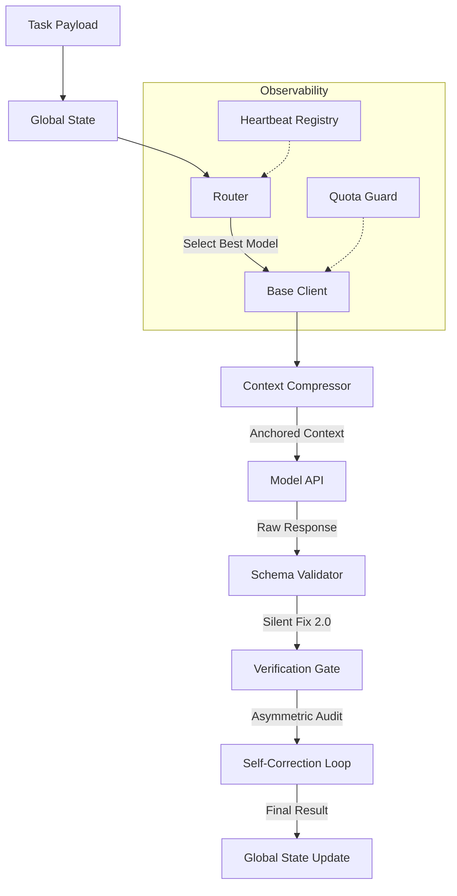

# 需求規劃文件 (RPD): Antigravity AI Kernel (Agent OS)

# Antigravity Agent OS (Model-Hub-Agent) - 實作規範 RPD 3.5

## 1. 系統願景 (Vision)
建立一個工業級、具備韌性的 AI 代理作業系統，透過分層調度、上下文壓縮與自動校驗，解決單一模型不可靠、上下文溢出以及成本失控的問題。

## 2. 系統架構圖 (Architecture)

## 3. 已實作核心模組 (Implemented Modules)

### ✅ 安全護欄與數據防禦 (Guardrail Layer)
*   **注入攻擊攔截**：自動偵測並阻斷 `Ignore previous instructions` 等常見提示詞注入手段。
*   **數據脫敏 (DLP)**：自動遮蔽 Payload 中的 API Keys、郵件地址與信用卡資訊，防止敏感數據外流。

### ✅ 級聯故障轉場 (Cascading Executor)
*   **自動降級**：當首選模型報錯、限流或格式校驗失敗時，自動將 Context 帶入次選模型重試。
*   **失敗感知**：將失敗模型標記為 `degraded`，防止短時間內再次調度到故障端點。

### ✅ 分層路由與監控 (Router & Heartbeat)
*   **健康感知調度**：自動避開狀態為 `degraded` 的模型，優先選擇延遲最低的路徑。
*   **Heartbeat Registry**：即時錄製各 API 端點的成功率與平均延遲。

### ✅ 核心錨點壓縮 (Key-Insight Anchoring)
*   **狀態防禦**：保護 `Objective` 與 `Constraints` 等核心欄位，確保壓縮後模型仍不忘初衷。
*   **彈性縮減**：自動摘要歷史對話，並在極限狀態下進行 Hard Truncation。

### ✅ 雙重驗證閘門 (Dual-Verification Gate)
*   **非對稱審計**：使用 Base-tier 模型監督 High-tier 輸出，達成低成本的品質監控。
*   **Risk Tags**：僅在 `coding`、`security` 等關鍵任務自動啟動驗證。

### ✅ 靜默修正 2.0 (SilentFix)
*   **結構化自癒**：支援 JSON 激進提取、非法換行轉義、括號補齊與註解剝離，大幅降低 Parse Error。

### ✅ 樂觀並行控制 (GlobalState)
*   **版本管理**：透過版本號與 `change_log` 追蹤狀態演進，防止多代理寫入衝突。

### ✅ GCP Vertex AI 後付款整合 (Postpaid Billing Integration)
*   **企業級繞過**：支援以 GCP 服務帳戶 JSON 金鑰產生 OAuth2 存取憑證，透過 `vertex-ai` 管道呼叫 Google Cloud Enterprise 的 `aiplatform` 服務，徹底解決 AI Studio 因計費同步 Bug 所產生的 `429` 錯誤。

### ✅ 文件轉 Markdown 預處理 (MarkItDown Engine)
*   **Token 壓縮率 50% - 90%**：整合微軟 `markitdown` 引擎，將 HTML、PDF、DOCX、XLSX 等原生文檔預先格式化為乾淨的 Markdown，去除過多贅餘標籤。對圖片/圖表進行單次 Vision OCR 後，重複利用該文字，避免多輪對話中重複支付昂貴的 Vision Token 費用。

### ✅ 主動式金鑰健康診斷 (Diagnostic Health Check Tool)
*   **主動式健檢**：一鍵向 Google AI Studio、GCP Vertex AI、NVIDIA NIM 及 DeepSeek 等所有註冊端點發送極小測試 Request，主動診斷並在終端機輸出清晰的健康狀態儀表板。

## 4. 狀態與一致性管理 (State Consistency)

### 4.1 具備日誌的狀態快照 (Snapshot with Change Log)
*   **功能**：`GlobalState` 實作 **「樂觀並行控制 (Optimistic Concurrency Control)」**。
    *   強制使用 `version` 欄位。寫入請求必須比對版本號，若不一致則觸發衝突解決或自動合併邏輯。
*   **價值**：防止多模型並行任務時產生的狀態覆蓋。

### 4.2 結構化輸出強制執行
*   **功能**：所有服務層通訊強制使用 JsonSchema 驗證。
*   **價值**：確保 `shared/` 定義的標準在全系統中得到嚴格執行。

## 5. 觀測與效率分析 (Observability 2.0)
*   **漂移監控儀 (Drift Monitor)**：定期執行基準測試，比較不同模型處理同一任務的輸出偏移量，並作為微調 (Fine-tuning) 數據集的來源。
*   **Token 效率分析**：統計各角色的「智力/成本比」，自動優化 `BudgetPredictor`。
*   **雙重驗證閘門 (Dual-Verification Gates)**：針對涉及法規或數值準確性的「高需求任務」，實作交叉驗證模式（如 Llama 驗證 Gemini 的輸出）。
*   **多模態感知路由**：Router 具備 `CapabilityTags` 識別能力，自動將視覺/OCR 任務導向支援多模態的 NVIDIA NIM 模型。
*   **文件預處理快取**：預處理適配器會快取轉檔後的 Markdown 文字，同一文件重複輸入時可達到「零耗時」與「零 Vision 扣款」。

## 6. 優先實作建議 (Actionable Steps)
1.  **Shared Foundation**：完成 `GlobalState` 與 `ToolSchema` 的 JSON 定義。
2.  **Adapter Layer**：實作具備「自動重試」與「靜默修正」能力的基礎 Client。
3.  **Router Logic**：開發支援「心跳狀態」讀取的動態調度器。
4.  **MarkItDown Preprocessor**：於任務調度入口引入自動文件轉換管道。
5.  **Diagnostic Tool CLI**：將金鑰診斷指令整合至 IDE 的快捷觸發命令中。
